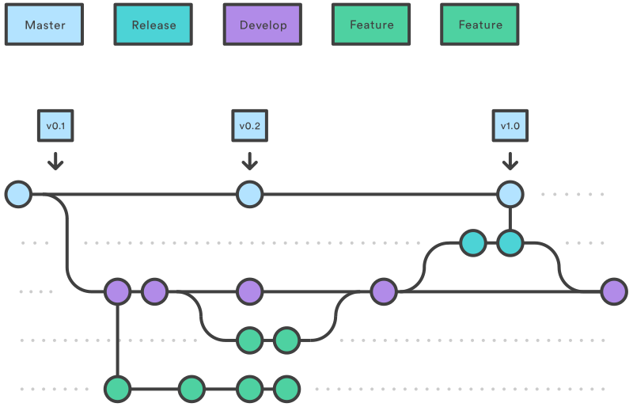

<!--
SPDX-FileCopyrightText: 'Copyright Contributors to the schema-composer project' 

SPDX-License-Identifier: Apache-2.0
-->

# How to Contribute

We'd love to accept your patches and contributions to this project. There are
just a few small guidelines you need to follow.

## Ways of contributing

Contribution does not necessarily mean committing code to the repository. 
We recognize different levels of contributions as shown below in increasing order of dedication:

1. Test and use the project. Give feedback on the user experience or suggest new features.
2. Report bugs or security vulnerability
3. Fix bugs.
4. Improve the project with developing new features.


## Filing bugs, security vulnerability or feature requests

You can file bugs against and feature requests for the project via github issues. Consult [GitHub Help](https://docs.github.com/en/free-pro-team@latest/github/managing-your-work-on-github/creating-an-issue) for more
information on using github issues.

If you think you've found a potential vulnerability in this project, please
email <YOUR_PROJECT_EMAIL_ADRESS@alliander.com> to responsibly disclose it.

## Community Guidelines

This project follows the following [Code of Conduct](CODE_OF_CONDUCT.md).

## REUSE Compliance & Source Code Headers

All the files in the repository need to be [REUSE compliant](https://reuse.software/). 
We use the pipeline to automatically check this.
If there are files which are not complying, the pipeline will fail the pull request will be blocked.

This means that every file containing source code must include copyright and license
information. This includes any JS/CSS files that you might be serving out to
browsers. (This is to help well-intentioned people avoid accidental copying that
doesn't comply with the license.)

Apache 2.0 header:

```
    SPDX-FileCopyrightText: 2022 Contributors to the <YOUR PROJECT NAME> project <YOUR_PROJECT_EMAIL_ADRESS@alliander.com>
    SPDX-License-Identifier: Apache-2.0
```

## Git branching

This project uses the [Gitflow Workflow](https://www.atlassian.com/git/tutorials/comparing-workflows/gitflow-workflow) and branching model. The `master` branch always contains the latest release, after a release is made new feature branches are branched of `develop`. When a feature is finished it is merged back into `develop`. At the end of a sprint `develop` is merged back into `master` or (optional) into a `release` branch first before it is merged into `master`.



## Signing the Developer Certificate of Origin (DCO)

This project utilize a Developer Certificate of Origin (DCO) to ensure that 
each commit was written by the author or that the author has the appropriate rights 
necessary to contribute the change. 
Specifically, we utilize [Developer Certificate of Origin, Version 1.1](http://developercertificate.org/), 
which is the same mechanism that the Linux® Kernel and many other communities use to manage code contributions. 
The DCO is considered one of the simplest tools for sign-offs from contributors as the representations are 
meant to be easy to read and indicating signoff is done as a part of the commit message.

This means that each commit must include a DCO which looks like this:

`Signed-off-by: Joe Smith <joe.smith@email.com>`

The project requires that the name used is your real name and the e-mail used is your real e-mail. 
Neither anonymous contributors nor those utilizing pseudonyms will be accepted.

There are other great tools out there to manage DCO signoffs for developers to make it much easier to do signoffs:
* Git makes it easy to add this line to your commit messages. Make sure the `user.name` and `user.email` are set in your git configs. Use `-s` or `--signoff` to add the Signed-off-by line to the end of the commit message.
* [Github UI automatic signoff capabilities](https://github.blog/changelog/2022-06-08-admins-can-require-sign-off-on-web-based-commits/) for adding the signoff automatically to commits made with the GitHub browser UI. This one can only be activated by the github org or repo admin. 
* [GitHub UI automatic signoff capabilities via custom plugin]( https://github.com/scottrigby/dco-gh-ui ) for adding the signoff automatically to commits made with the GitHub browser UI
* Additionally, it is possible to use shell scripting to automatically apply the sign-off. For an example for bash to be put into a .bashrc file, see [here](https://wiki.lfenergy.org/display/HOME/Contribution+and+Compliance+Guidelines+for+LF+Energy+Foundation+hosted+projects). 
* Alternatively, you can add `prepare-commit-msg hook` in .git/hooks directory. For an example, see [here](https://github.com/Samsung/ONE-vscode/wiki/ONE-vscode-Developer's-Certificate-of-Origin).

## Code reviews

All patches and contributions, including patches and contributions by project members, require review by one of the maintainers of the project. We
use GitHub pull requests for this purpose. Consult
[GitHub Help](https://help.github.com/articles/about-pull-requests/) for more
information on using pull requests.

## Pull Request Process
Contributions should be submitted as Github pull requests. See [Creating a pull request](https://docs.github.com/en/github/collaborating-with-issues-and-pull-requests/creating-a-pull-request) if you're unfamiliar with this concept.

The process for a code change and pull request you should follow:

1. Create a topic branch in your local repository, following the naming format
"feature-[description]". For more information see the Git branching guideline.
1. Make changes, compile, and test thoroughly. Ensure any install or build dependencies are removed before the end of the layer when doing a build. Code style should match existing style and conventions, and changes should be focused on the topic the pull request will be addressed. For more information see the style guide.
1. Push commits to your fork.
1. Create a Github pull request from your topic branch.
1. Pull requests will be reviewed by one of the maintainers who may discuss, offer constructive feedback, request changes, or approve
the work. For more information see the Code review guideline.
1. Upon receiving the sign-off of one of the maintainers you may merge your changes, or if you
   do not have permission to do that, you may request a maintainer to merge it for you.


## Attribution

This Contributing.md is adapted from Google
available at
https://github.com/google/new-project/blob/master/docs/contributing.md
